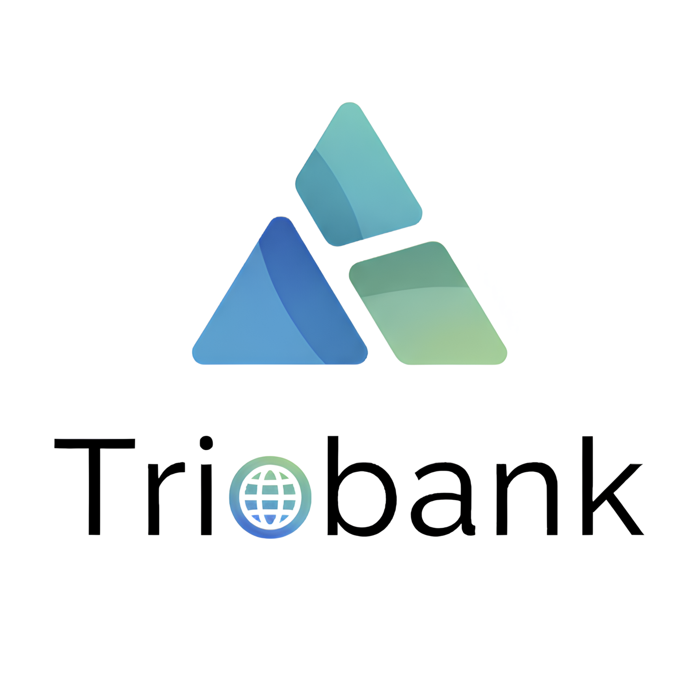

  

<h1 align="center">TrioBank</h1>

  Modern, ölçeklenebilir bir çevrimiçi bankacılık uygulaması.
   
  Bu proje, okul ödevi kapsamında "mikroservis mimarisi" ve "olay güdümlü tasarım" (Event-Driven Architecture) kullanılarak geliştirilmektedir.
    
  
  

---

### 🚀 Proje Vizyonu ve Hedefleri

**TrioBank**, modern bankacılık sistemlerinin temel gereksinimlerini karşılayan, **ölçeklenebilir**, **dayanıklı (resilient)** ve **bakımı kolay** bir sistem oluşturmayı amaçlar. Bu projede özellikle aşağıdaki teknik hedeflere odaklanıyoruz:

* **Mikroservis Mimarisi:** İş mantığını bağımsız servisler (Kullanıcı, Hesap, Transfer vb.) üzerinden yönetmek, servisler arası bağımlılığı en aza indirmek.
* **Olay Güdümlü (Event-Driven) Tasarım:** Servisler arası iletişimi asenkron mesajlaşma (Apache Kafka, RabbitMQ) ile sağlamak.
* **Outbox Pattern:** Veritabanı işlemleri ile mesaj gönderimlerini atomik hale getirerek veri tutarlılığını garanti altına almak.
* **Polyglot Programlama:** İş gereksinimlerine göre doğru araçları kullanmak; örneğin **Java (Spring Boot)** ve **Go (Golang)**.

---

### 💻 Teknoloji Yığını (Tech Stack)

| Kategori | Teknoloji |
| :--- | :--- |
| **Backend** |    |
| **Frontend** |  |
| **Veritabanı** |  |
| **Mesajlaşma & Olay** |   |
| **Araçlar & DevOps** |    |

---

### 🏗️ Yüksek Seviye Mimari (High-Level Architecture)

Sistem mimarisi temel olarak şu katmanlardan oluşur:

1. **API Gateway:** Tüm istekleri karşılar, kimlik doğrulama ve yönlendirme sağlar.
2. **Mikroservisler:** Account, Transaction, Payment vb. bağımsız servisler.
3. **Mesajlaşma Katmanı:** Servisler arası asenkron veri iletimi için Kafka kullanılır.
4. **Veritabanı:** Her servis kendi veri deposuna sahiptir.

---

### 👥 Ekibimiz (The "Trio")

| Avatar | İsim | GitHub |
| :---: | :---: | :---: |
|  | Rıdvan AKYÜREK | [@akyurekridvan2101](https://github.com/akyurekridvan2101) |
|  | Bereket İŞ | [@bereketis72](https://github.com/bereketis72) |
|  | Samed ÖZTÜRK | [@samedozturk](https://github.com/samedozturk) |

---

### 📂 Proje Depoları (Repositories)

---

### 📜 Lisans

Bu proje MIT Lisansı altında yayımlanmıştır. Detaylar için `LICENSE` dosyasına bakabilirsiniz.
